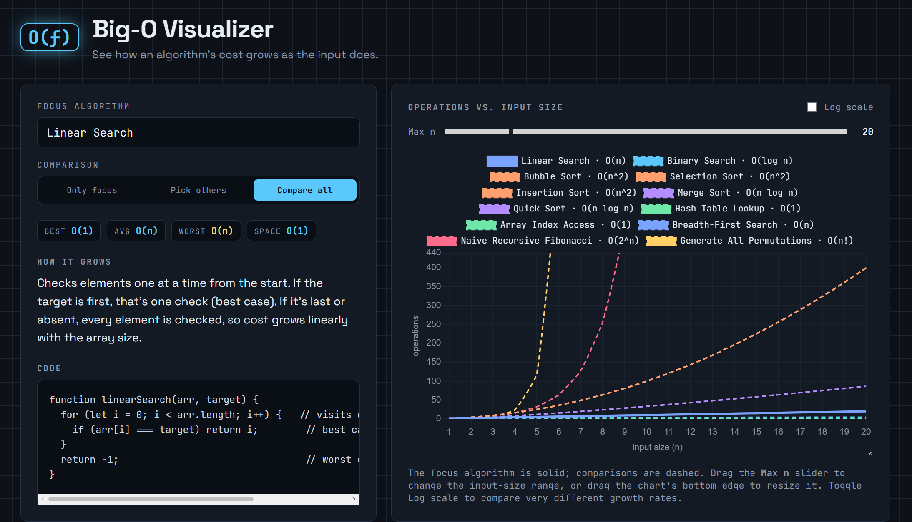

# Big-O Visualizer

A lightweight web app that helps students *see* time and space complexity instead of just memorizing it. Pick a classic algorithm and get an annotated walkthrough plus a live chart comparing how it scales against other complexity classes.

🔗 **Live demo:** [bigo-visualizer.vercel.app](https://bigo-visualizer.vercel.app) <!-- update once deployed -->

() <!-- add a screenshot or GIF once the UI is ready -->


## Why I built this

Big-O notation is one of those topics that's easy to memorize and hard to actually *get*. I kept forgetting why certain loops were O(n²) vs O(n log n) until I could see the growth curves side by side — so I built the tool I wished I had.

## Features

- 📚 Library of classic algorithms (sorting, searching, graph traversal, recursion) with annotated code explaining *why* each has its complexity
- 📈 Interactive chart comparing growth curves (O(1), O(log n), O(n), O(n log n), O(n²), O(2ⁿ))
- ⚡ Zero backend — runs entirely in the browser
- 🎯 Built for CS students studying for coursework or technical interviews

## Tech Stack

- HTML / CSS / JavaScript (no framework — kept intentionally simple)
- [Chart.js](https://www.chartjs.org/) for the growth-curve visualizations
- Hosted on [Vercel](https://vercel.com)

## Getting Started

Clone the repo and open `index.html` in your browser — no build step or dependencies required.

```bash
git clone https://github.com/YOUR-USERNAME/bigo-visualizer.git
cd bigo-visualizer
```

For live-reload during development, use the [Live Server VS Code extension](https://marketplace.visualstudio.com/items?itemName=ritwickdey.LiveServer) and open `index.html` with it.

## Project Structure

```
bigo-visualizer/
├── index.html          # Main page
├── style.css           # Styling
├── script.js           # App logic (dropdown, chart rendering)
└── data/
    └── algorithms.js   # Algorithm library + complexity data
```

## Roadmap

- [ ] Expand algorithm library to ~15 entries
- [ ] Add "paste your own code" mode with complexity estimation
- [ ] Add quiz/practice mode (guess the complexity)
- [ ] Custom domain

## Contributing

This is a small solo learning project, but suggestions and PRs are welcome — feel free to open an issue if you spot a bug or have an algorithm you'd like added.

## License

[MIT](./LICENSE)
